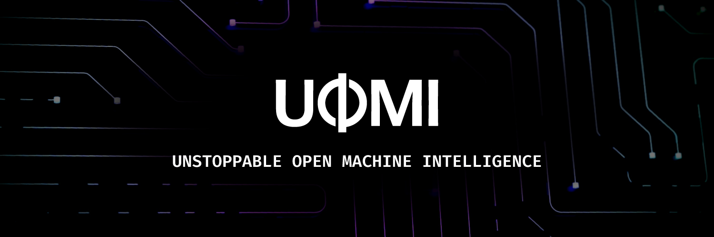

# Learn

<figure><figcaption></figcaption></figure>

**UOMI** is an interoperable blockchain platform designed for the **Polkadot** and **Ethereum** ecosystems, supporting both **Wasm** and **EVM** smart contracts. This guide will help you quickly get up to speed with the core components of our platform.

Whether you're managing accounts, deploying smart contracts, you'll find all the essential information here to start building with UOMI. Dive into a new era of decentralized, AI-driven economic agents and explore the limitless possibilities of our innovative blockchain ecosystem!

